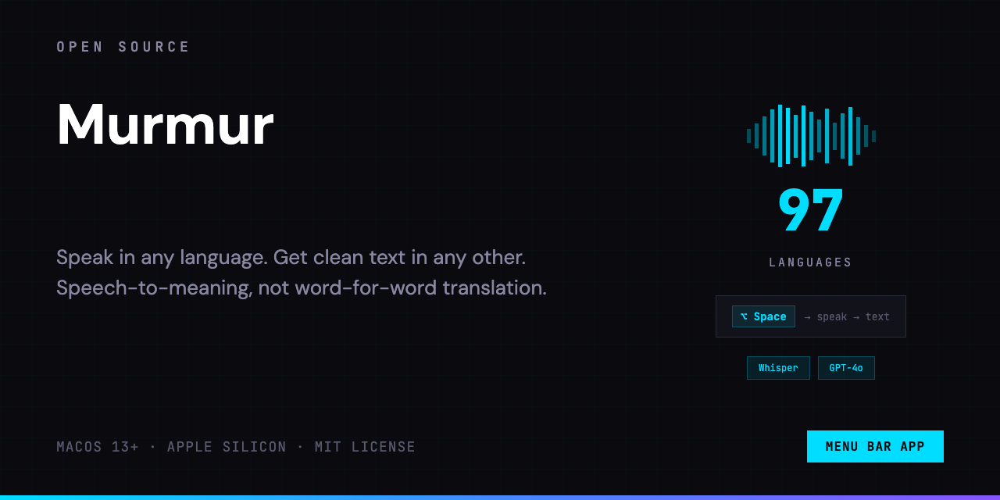

<p align="center">
  
</p>

<p align="center">
<a href="../README.md"></a>&nbsp;
<a href="README_RU.md"></a>&nbsp;
<a href="README_ES.md"></a>&nbsp;
<a href="README_ZH.md"></a>&nbsp;
<a href="README_AR.md"></a>&nbsp;
<a href="README_FR.md"></a>&nbsp;
<a href="README_BN.md"></a>&nbsp;
<a href="README_PT.md"></a>&nbsp;
<a href="README_UR.md"></a>
</p>

Murmur शब्द-दर-शब्द अनुवाद नहीं करता। यह समझता है कि आप कहना क्या चाहते हैं, और उसे ऐसे लिखता है जैसे उस भाषा का कोई देसी बोलने वाला लिखे।

## 😤 समस्या

गैर-मातृभाषा में लिखना धीमा होता है। आप या तो:

- अपनी भाषा में लिखते हैं, ट्रांसलेटर में पेस्ट करते हैं, फिर अजीब नतीजे को ठीक करते हैं
- सीधे लक्षित भाषा में लिखते हैं, हर शब्द पर संदेह करते हैं, शब्दकोश खंगालते हैं, बार-बार पढ़ते हैं कि सही लग रहा है या नहीं
- AI से अनुवाद कराते हैं, फिर एडिट करने में समय लगाते हैं क्योंकि आउटपुट या तो बहुत शाब्दिक होता है या लहज़ा गलत होता है

AI एजेंट्स के साथ काम करते समय यह और भी मुश्किल हो जाता है, जहाँ अंग्रेज़ी बेहतर विकल्प है (कम टोकन, बेहतर मॉडल समझ), लेकिन सोचने की प्रक्रिया आपकी मातृभाषा में होती है।

## 💡 समाधान

हॉटकी दबाएं। जो कहना है वो बोलें। अपनी ज़रूरत की भाषा में तैयार मैसेज पाएं।

```
Option+Space  →  किसी भी भाषा में बोलें  →  Option+Space
                                                ↓
                                  साफ़ टेक्स्ट वहीं आ जाता है जहाँ आप टाइप कर रहे हैं
```

Murmur शब्द-दर-शब्द अनुवाद नहीं करता। यह आपकी बोली गई बात को लेता है, फ़िलर और ग़ैर-ज़रूरी शब्द हटाता है, और ऐसा टेक्स्ट तैयार करता है जो लक्षित भाषा के व्याकरण, लहज़े और शैली का पालन करता है। नतीजा ऐसा पढ़ा जाता है जैसे लिखा गया हो, अनुवादित नहीं।

## ⚙️ यह कैसे काम करता है

1. **हॉटकी दबाएं** (डिफ़ॉल्ट `Option + Space`)। रिकॉर्डिंग इंडिकेटर दिखेगा।
2. **बोलें** किसी भी भाषा में। जैसे सोचते हैं, वैसे बोलें।
3. **क्लिक करें** किसी भी टेक्स्ट फ़ील्ड में (ब्राउज़र, एडिटर, मैसेंजर, टर्मिनल)।
4. **हॉटकी फिर से दबाएं।** टेक्स्ट वहीं आ जाएगा जहाँ आपको चाहिए।

ऐप स्विच नहीं। कॉपी-पेस्ट नहीं। एडिटिंग नहीं।

[डेमो देखें (2 मिनट)](https://youtube.com/shorts/4Qr3jkadVsQ)

## 🔀 तीन मोड

- **Transcription**: बोली गई भाषा में कच्चा स्पीच-टू-टेक्स्ट।
- **Clean-up**: वही भाषा, लेकिन सफ़ाई के साथ। कोई फ़िलर शब्द नहीं, सही व्याकरण, सुव्यवस्थित वाक्य। सूचियाँ अपने-आप फ़ॉर्मेट हो जाती हैं।
- **Translation**: एक भाषा में बोलें, दूसरी भाषा में साफ़ टेक्स्ट पाएं। 97 भाषाएँ उपलब्ध हैं। वही सफ़ाई यहाँ भी लागू होती है: आउटपुट ऐसा पढ़ा जाता है जैसे मूल वक्ता ने लिखा हो, अनुवाद नहीं।

## 📦 इंस्टॉल करें

[Releases](https://github.com/alexe-ev/Murmur/releases) से `Murmur.dmg` डाउनलोड करें, Applications में ड्रैग करें।

> ऐप नोटराइज़्ड नहीं है। macOS पहली बार खोलने पर इसे ब्लॉक करेगा। इसे ठीक करने के लिए Terminal में यह कमांड चलाएं:
> ```
> xattr -cr /Applications/Murmur.app
> ```
> उसके बाद ऐप सामान्य रूप से खोलें।

### सोर्स से बिल्ड करें

```bash
git clone https://github.com/alexe-ev/Murmur.git
cd Murmur
xcodebuild -scheme Murmur -configuration Release -derivedDataPath build
cp -R build/Build/Products/Release/Murmur.app /Applications/
```

### सेटअप

पहली बार चलाने पर **Microphone** और **Accessibility** की अनुमति दें। Settings में अपनी [OpenAI API key](https://platform.openai.com/api-keys) दर्ज करें।

## 📋 आवश्यकताएं

- macOS 13.0+ (Ventura या बाद का)
- Apple Silicon (M1/M2/M3/M4)
- OpenAI API key

ऑडियो रिकॉर्डिंग अस्थायी होती हैं और ट्रांसक्रिप्शन के तुरंत बाद हटा दी जाती हैं। आपकी API key आपकी मशीन पर स्थानीय रूप से सुरक्षित रहती है।

## 📄 लाइसेंस

[MIT](../LICENSE)
